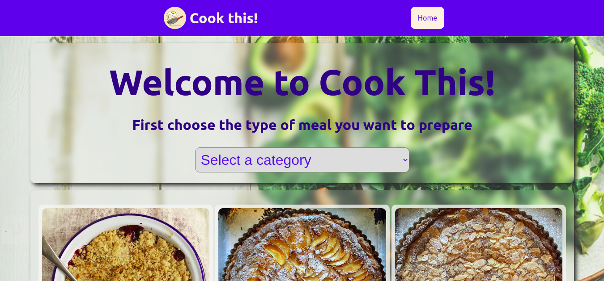
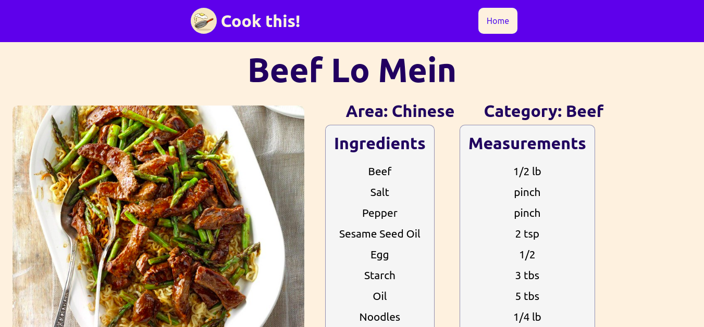
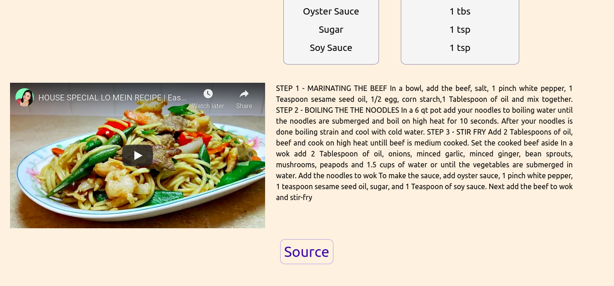

#	PROJECT: React Capstone Catalogue of Recipes

> This is a Catalogue of Recipes populated using theMealDB API. Users can search recipes by category and go to recipe page where they will find detailed instructions, list of ingredients and measurements, area the recipe originated from and even a video tutorial. Built using React & Redux.

> This is tha main page here the user will find a welcome message prompting them to choose a category from select box and below a list of all related recipes will be displayed with an image, the recipe name and a button to see recipe page.

> This is the recipe page here the full recipe info will be displayed. The user can see an image example of complete meal, area & category which it belongs to, list of ingredients & measurements, text instructions and a video tutorial when available.

## Getting Started

### `git clone https://github.com/jurgen1c/cook-this-react-capstone.git`

### `cd cook-this-react-capstone`

### `npm install`

## Available Scripts

### `npm start`

Runs the app in the development mode.\

### `npm test`

Launches the test runner in the interactive watch mode.\

### `npm run build`

Builds the app for production to the `build` folder.\
It correctly bundles React in production mode and optimizes the build for the best performance.

### Build With

-	React
- Redux
- JavaScript
-	CSS  

### Check out the live version [here](https://cook-this-jcg.herokuapp.com/)     

## 👤 Authors

👤 **Jurgen Clausen Gutierrez**

- Github: [@jurgen1c](https://github.com/jurgen1c)
- LinkedIn: [jurgen-clausen](https://www.linkedin.com/in/jurgen-clausen-2740061a9/)

## Show your support

Give a ⭐️ if you like this project!

## Acknowledgments

- Microverse
- etc